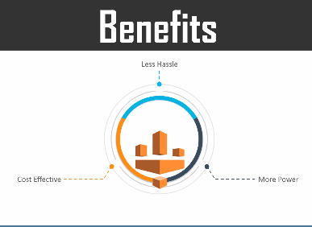
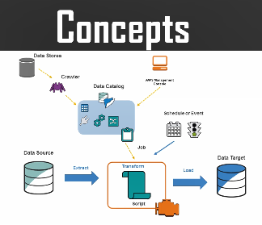
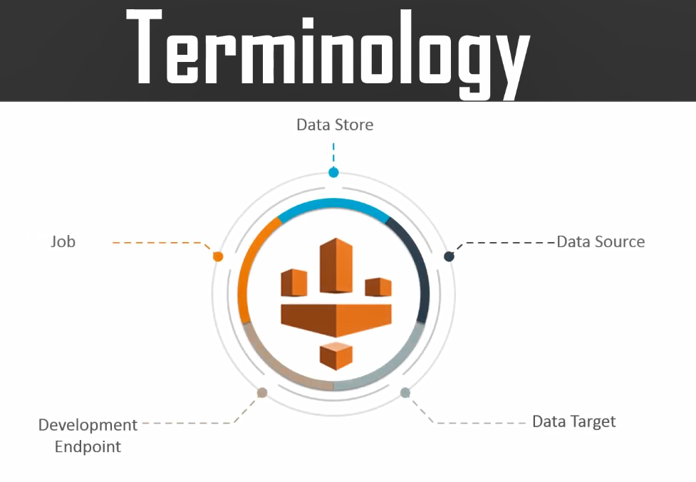
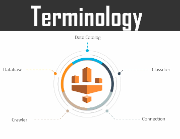

## AWS GLUE
- what is AWS GLUE ?
- When do you use aws glue  ?
- what is aws glue benefits ?
- what is aws glue concepts ?
- aws glue terminology ?
- How does aws glue works ?

## what is AWS GLUE ?
```
AWS Glue is fully Managed ETL(Extra Transform,and Load) service that makes it simple and cost-effective to categorize your data, clean it, enrich it and move it reliably between various data stores
```
## When do you use aws glue  ?

- To build a Data warehouse to organize,cleanse,validate,and formate data. 
- you can transform and move aws cloud data in to a data store.
- you can also load data from disparate sources into data warehouse for regular reporting and analysis.
- By storing in to a data warehouse you can integrate information from different parts of your buisenes and provide a common source of data for decission making 

## what is aws glue benefits ?

**Less Hassle**
- AWS-Glue is integrated with across wide range of aws-services 
- AWS-Glue Nativele supports Data store aws aurora,and other RDS-engines,AWS-Redshift,AWS-S3 and along with common database engines and data bases in virtual private cloud(vpc), Running on Amazon Ec2-Instances

**CostEffective**
- AWS-Glue is server less there is no infrastructure to manage
- AWS-Glue handiles provisining configuration and scaling of the resources required to rune the ETL Jobs are fullle managed scaled apaches part envenorment
- You pay only for the resources that you use while your jobs are running 

**More Power:**
- AWS-Glue Automate the much of the efort in building,maintaining,and running ETL jobs.
- It crops your data sources identifyesdatsa formate  as suggest schemas and transformations
- AWS Glue automaticaly genarates the code to execute your data transformation and loading processes




## AWS-Glue concepts


## AWS-Glue terminology ?
**Data Catalog:** 
- Data catalog is nothing but persistent metadata store in AWS-Glue It contains table definations job definations other controle information to manage your AWS-Glue envinorment
- Each Aws account has one Data Catalog for region 
**Classifier:** 
- The classifier determins the schema of data. AWS-Glue provides Classifier common file types such csv json xml and soon 
- It also provides classifiers for common relational database management systems using the JDBC connection
- You can write your own classifier By using a grock parten or by specifinng rote an in xml doc
**Connection**
- Connection containg the properties that are require to connect to your data store   
**Crawler**
- crawler is nothing but a program that connects to a data store May be a source or in target progresses through priorities list of classifiers to determing the schema for the data
- Then it creates meta data tables  in data calalogu
**Database**
- Database is a set of associated data calatogue table definations  orginised in to logical group in aws group





**Data Store**
- A data store is a repository for persistentle storing your data the examples is AWS-S3 , and RDS
**Data Source**
- A data source is target data store that is used as an input  to process or transform
**Data Target** 
- A data target is a data store that process transform writes to
**Development Endpoint**
- Development end point is an envernoment that you can use to develop and test your AWS-Glue ETL scripts
**Job**
- A job is nothing but a Buiseness logic


