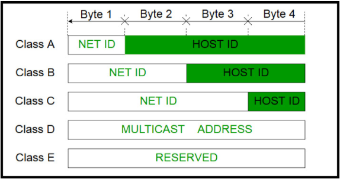

## What is VPC
[Architecture of VPC](https://www.javatpoint.com/aws-vpc)
## Create a new VPC
- **step-1:** Create vpc
- **step-2:** create a subnet 
- **step-3:** create a Internet Gateway 
- **step-4:** create 

## Classless Inter Domain Routing (CIDR) Block

- Class A network contains 224 Hosts, (2 power 24)
- Class B network contains 216 Hosts, (2 power 16)
- Class C network contains 28 Hosts   (2 power 8)

